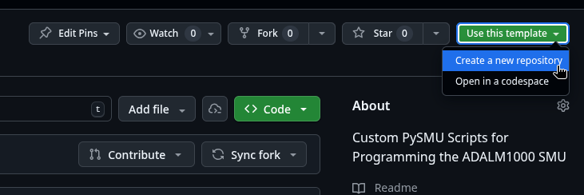
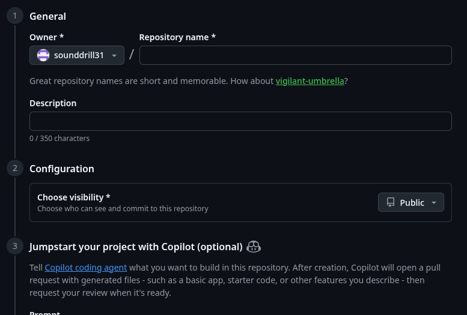

# Programming for the ADALM1000 in Python

A Python library and set of tools for the Analog Devices ADALM1000 Active Learning Module.

---

This Repository builds upon @aditya-rao-iit-m's work and tries to make it easier to templatize pysmu projects and scripts. 

--- 

## Template Instructions

Check top right of the repo and click on `Use this template.` -> `Create a new Repository`



Fill out an appropriate name for the script that is concise, and aptly communicates the purpose of the script, like `SquareWave-ADALM1000` and optionally add a short description. 



Finally scroll to the bottom of the page and click submit. Make a note of the URL, you will need it very soon in the next step!

Edit the [main.py](./main.py) file here to make modifications to your code.

## Windows/Linux/Mac Install Instructions
0. Install Prefix.Dev's `pixi` as per official instructions at https://pixi.sh/latest/#installation <!-- Instructions after here will work on Windows too provided deps like python3 and git are installed-->
    - Close your terminal window and open another one after installing.
1. Ensure that `git` is already installed and are accessible from the terminal! Try running just the `git` command to see if it gives you usage instructions.  
    - If you are sure that it is not already installed, run the following command:
        ```bash
        pixi global install git
        ```  
        This will quickly set up git using the same pixi tool.
2. Prepare workspace with the command
    ```bash
    git clone https://github.com/m1k-builds/pysmu-adalm1000-template adalm1000
    ```  
    or replace `m1k-builds/pysmu-adalm1000-template` with your repository that you made in the previous section. The final `adalm1000` at the end of the command tells the git tool to clone to `adalm1000` folder/directory.
    ```bash
    git clone https://github.com/yourusername/yourreponame adalm1000
    ```  
    and enter the directory
    ```bash
    cd adalm1000
    ```  
3. Run the following Command to let `pixi` setup your environment
    ```bash
    pixi install
    ```
4. Start `main.py`
    ```bash
    pixi run main
    ```
---

# Credits
## Original Program: RGB+PIO Cycle Script 
- **Author:** Aditya Rao (`23f3000019@es.study.iitm.ac.in`)
- **Program:** BS in Electronic Systems, IIT Madras
- **Date:** Friday, 5th April 2024
